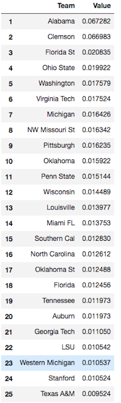
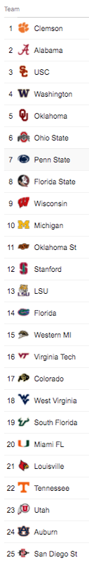

# Markov_Football_Ranking
Implement a Markov Chain approach to rank 760 college football teams based on the scores of every game in the 2016 season.

## Data

The data provided in CFB2016 scores.csv contains the result of one game on each line in the format:

Team A index, Team A points, Team B index, Team B points.

If Team A has more points than Team B, then Team A wins, and vice versa. The index of a team refers to the row of “TeamNames.txt” where that team’s name can be found.

## Technology Used
- Python 3

## Algorithm

## Results

We can see that our naive algorithm (that has no knowledge of football) ranking is very similar with ranking made by professionals who get paid to do this!

 

We can safely assume that we don't need to try to increase the number of steps as this ranking is the best our algorithm can produce. We know this by looking at the difference between the stationary and state distribution after each step. 

